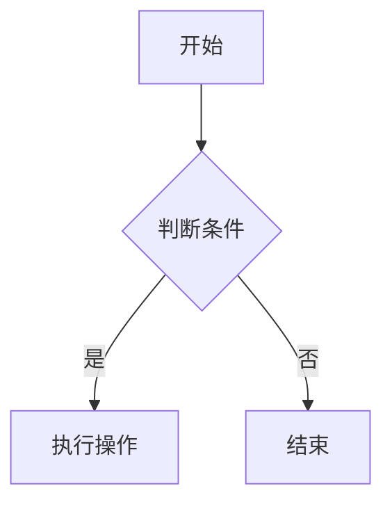

# 历史方案存档

本文档记录了项目开发过程中尝试过但最终放弃的复杂实现方案，作为技术参考和经验总结。

## 方案一：复杂的 FlowchartPanel 类

### 实现概述
- 创建了一个复杂的 `FlowchartPanel` 类 (3000+ 行代码)
- 支持多种渲染模式：Mermaid、Canvas、JSON
- 包含完整的设置界面和配置管理
- 支持多种输出格式：标准 Mermaid、Fabric 格式、JSON

### 技术特点
```typescript
class FlowchartPanel {
    // 支持多种显示模式
    private static _panels = new Map<string, FlowchartPanel>();
    
    // 复杂的消息处理系统
    private _handleMessage(message: any) {
        switch (message.command) {
            case 'renderMermaidFlowchart':
            case 'renderJsonFlowchart':
            case 'switchToAlternativeData':
            case 'exportSvg':
            case 'exportPng':
            // ... 20+ 种消息类型
        }
    }
    
    // 3000+ 行的 HTML 模板
    private _getHtmlForWebview(): string {
        // 包含完整的 UI 界面
        // Mermaid + Fabric.js + 复杂的样式系统
    }
}
```

### 问题分析
1. **消息传递复杂** - WebView 和 Extension 之间的消息容易丢失
2. **调试困难** - 复杂的消息流难以追踪
3. **维护成本高** - 代码量大，功能耦合严重
4. **用户体验差** - 功能过多，界面复杂

## 方案二：多格式输出系统

### 实现概述
支持多种流程图输出格式：
- 标准 Mermaid 格式
- Fabric 格式 (带 %% 注释)
- JSON 格式
- 增强 Mermaid+JSON 格式

### 配置系统
```typescript
interface OutputFormatConfig {
    standardMermaid: boolean;    // 标准 Mermaid
    fabricMermaid: boolean;      // Fabric 格式
    jsonFormat: boolean;         // JSON 格式
    enhancedFormat: boolean;     // 增强格式
}
```

### Fabric 格式示例


### 问题分析
1. **格式混乱** - 多种格式增加用户困惑
2. **AI 生成不稳定** - 不同格式的 AI 生成质量差异大
3. **配置复杂** - 用户需要理解各种格式的区别
4. **维护困难** - 需要同时维护多套渲染逻辑

## 方案三：复杂的配置管理系统

### 实现概述
创建了完整的配置管理界面：
- URL 配置
- 模型选择
- 输出格式选择
- 渲染器选择
- 主题配置

### 配置界面特点
```html
<!-- 复杂的设置界面 -->
<div class="settings-container">
    <div class="settings-group">
        <div class="settings-title">API 配置</div>
        <input type="text" id="urlInput" placeholder="API URL">
        <button class="refresh-button">🔄</button>
    </div>
    
    <div class="settings-group">
        <div class="settings-title">模型选择</div>
        <select id="modelSelect">
            <!-- 动态加载模型列表 -->
        </select>
    </div>
    
    <div class="settings-group">
        <div class="settings-title">输出格式</div>
        <div class="radio-group">
            <input type="radio" name="format" value="standard">
            <input type="radio" name="format" value="fabric">
            <input type="radio" name="format" value="json">
        </div>
    </div>
</div>
```

### 问题分析
1. **过度设计** - 大多数用户只需要基本功能
2. **UI 复杂** - 设置选项过多，用户体验差
3. **状态管理复杂** - 配置同步和持久化困难
4. **测试困难** - 配置组合过多，难以全面测试

## 方案四：Canvas 渲染系统

### 实现概述
使用 Fabric.js 实现自定义 Canvas 渲染：
- 支持拖拽编辑
- 自定义节点样式
- 动态布局算法
- 导出为多种格式

### 技术实现
```typescript
// Fabric.js Canvas 实现
class CanvasRenderer {
    private fabricCanvas: fabric.Canvas;
    
    renderFlowchart(data: FlowchartData) {
        // 创建节点
        data.nodes.forEach(node => {
            const rect = new fabric.Rect({
                left: node.x,
                top: node.y,
                width: node.width,
                height: node.height,
                fill: node.color
            });
            this.fabricCanvas.add(rect);
        });
        
        // 创建连线
        data.edges.forEach(edge => {
            const line = new fabric.Line([
                edge.from.x, edge.from.y,
                edge.to.x, edge.to.y
            ]);
            this.fabricCanvas.add(line);
        });
    }
}
```

### 问题分析
1. **复杂度过高** - Canvas 渲染比 Mermaid 复杂得多
2. **性能问题** - 大型流程图渲染性能差
3. **兼容性问题** - Fabric.js 在 WebView 中的兼容性问题
4. **开发成本高** - 需要实现完整的图形编辑器功能

## 经验总结

### 失败原因分析
1. **功能过载** - 试图在一个扩展中实现过多功能
2. **过度工程化** - 为了灵活性牺牲了简洁性
3. **用户需求误判** - 用户实际只需要简单的流程图生成
4. **技术选型错误** - 选择了过于复杂的技术栈

### 成功因素识别
1. **专注核心功能** - 只做流程图生成这一件事
2. **简化技术栈** - 使用成熟稳定的 Mermaid.js
3. **减少配置** - 提供合理的默认值，减少用户配置
4. **快速迭代** - 先实现基本功能，再逐步优化

### 设计原则
1. **KISS 原则** - Keep It Simple, Stupid
2. **用户优先** - 以用户体验为中心，而非技术炫技
3. **渐进增强** - 先实现核心功能，再添加高级特性
4. **可维护性** - 代码简洁，易于理解和维护

## 技术债务清理

### 已删除的复杂代码
- `FlowchartPanel.ts` (3000+ 行) → 简化为 `showSimpleFlowchart()` (100 行)
- 复杂的配置系统 → 基本的 VS Code 配置
- 多格式输出 → 统一使用标准 Mermaid
- Canvas 渲染器 → 纯 Mermaid.js 渲染

### 保留的核心代码
- `ChatViewProvider.ts` - 聊天界面 (简化版)
- `aiService.ts` - AI 服务集成
- `flowchartGenerator.ts` - 流程图生成逻辑
- `codeExtractor.ts` - 代码提取工具

这些历史方案虽然最终被放弃，但为我们提供了宝贵的经验教训，帮助我们找到了正确的技术方向。
